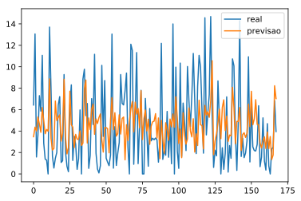
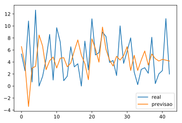
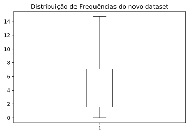
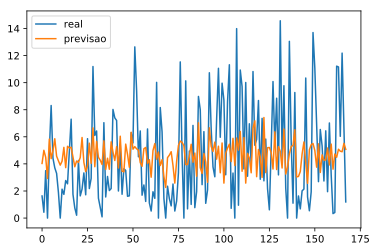
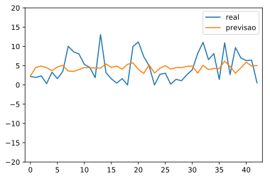

# ForestFires

Modelo Machine Learning, utilizando Redes Neurais Artificiais, para reaalização da tarefa de regressão para prever áreas (em hectares) de Incêndios Florestais, a partir de dados encontrados no [Forest Fires Dataset](https://archive.ics.uci.edu/ml/datasets/Forest+Fires)

### Bibliotecas


```python
import pandas as pd
from sklearn.model_selection import train_test_split
from sklearn.neural_network import MLPRegressor
from sklearn.metrics import mean_squared_error
from matplotlib import pyplot as plt
from random import randint

%matplotlib inline
%config InlineBackend.figure_format='svg'
```

### Dataset


```python
#Importacao do dataset
dataset = pd.read_csv('forestfires.csv')

#Categorização do atributo 'month'
data_month = pd.get_dummies(dataset['month'])
dataset = pd.concat([dataset, data_month], axis=1)
#Categorização do atributo 'day'
data_day = pd.get_dummies(dataset['day'])
dataset = pd.concat([dataset, data_day], axis=1)
#Exclusao das colunas nao categorizadas 'month' e 'day'
dataset = dataset.drop(['month', 'day'], axis = 1)

#Cabeçalho dataset
dataset.head()
```


<div>
<style scoped>
    .dataframe tbody tr th:only-of-type {
        vertical-align: middle;
    }

    .dataframe tbody tr th {
        vertical-align: top;
    }

    .dataframe thead th {
        text-align: right;
    }
</style>
<table border="1" class="dataframe">
  <thead>
    <tr style="text-align: right;">
      <th></th>
      <th>X</th>
      <th>Y</th>
      <th>FFMC</th>
      <th>DMC</th>
      <th>DC</th>
      <th>ISI</th>
      <th>temp</th>
      <th>RH</th>
      <th>wind</th>
      <th>rain</th>
      <th>...</th>
      <th>nov</th>
      <th>oct</th>
      <th>sep</th>
      <th>fri</th>
      <th>mon</th>
      <th>sat</th>
      <th>sun</th>
      <th>thu</th>
      <th>tue</th>
      <th>wed</th>
    </tr>
  </thead>
  <tbody>
    <tr>
      <th>0</th>
      <td>7</td>
      <td>5</td>
      <td>86.2</td>
      <td>26.2</td>
      <td>94.3</td>
      <td>5.1</td>
      <td>8.2</td>
      <td>51</td>
      <td>6.7</td>
      <td>0.0</td>
      <td>...</td>
      <td>0</td>
      <td>0</td>
      <td>0</td>
      <td>1</td>
      <td>0</td>
      <td>0</td>
      <td>0</td>
      <td>0</td>
      <td>0</td>
      <td>0</td>
    </tr>
    <tr>
      <th>1</th>
      <td>7</td>
      <td>4</td>
      <td>90.6</td>
      <td>35.4</td>
      <td>669.1</td>
      <td>6.7</td>
      <td>18.0</td>
      <td>33</td>
      <td>0.9</td>
      <td>0.0</td>
      <td>...</td>
      <td>0</td>
      <td>1</td>
      <td>0</td>
      <td>0</td>
      <td>0</td>
      <td>0</td>
      <td>0</td>
      <td>0</td>
      <td>1</td>
      <td>0</td>
    </tr>
    <tr>
      <th>2</th>
      <td>7</td>
      <td>4</td>
      <td>90.6</td>
      <td>43.7</td>
      <td>686.9</td>
      <td>6.7</td>
      <td>14.6</td>
      <td>33</td>
      <td>1.3</td>
      <td>0.0</td>
      <td>...</td>
      <td>0</td>
      <td>1</td>
      <td>0</td>
      <td>0</td>
      <td>0</td>
      <td>1</td>
      <td>0</td>
      <td>0</td>
      <td>0</td>
      <td>0</td>
    </tr>
    <tr>
      <th>3</th>
      <td>8</td>
      <td>6</td>
      <td>91.7</td>
      <td>33.3</td>
      <td>77.5</td>
      <td>9.0</td>
      <td>8.3</td>
      <td>97</td>
      <td>4.0</td>
      <td>0.2</td>
      <td>...</td>
      <td>0</td>
      <td>0</td>
      <td>0</td>
      <td>1</td>
      <td>0</td>
      <td>0</td>
      <td>0</td>
      <td>0</td>
      <td>0</td>
      <td>0</td>
    </tr>
    <tr>
      <th>4</th>
      <td>8</td>
      <td>6</td>
      <td>89.3</td>
      <td>51.3</td>
      <td>102.2</td>
      <td>9.6</td>
      <td>11.4</td>
      <td>99</td>
      <td>1.8</td>
      <td>0.0</td>
      <td>...</td>
      <td>0</td>
      <td>0</td>
      <td>0</td>
      <td>0</td>
      <td>0</td>
      <td>0</td>
      <td>1</td>
      <td>0</td>
      <td>0</td>
      <td>0</td>
    </tr>
  </tbody>
</table>
<p>5 rows × 30 columns</p>
</div>


### Análise do Dataset


```python
plt.hist(dataset.area, bins=110)
plt.title('Distribuição de Frequência de Área')
plt.show()
```


Podemos analisar a maior ocorrência de pequenas áreas queimadas, uma vez que o número de áreas entre 0 e 100 hectares de incêndios florestas é muito superior em relação ao restante do dataset. Assim, podemos concluir que o dataset é extremamente desbalanceado.

## Treinamento e teste para todos os dados do dataset
### Holdout 95-5


```python
y = dataset['area']
x = dataset.drop(['area'], axis=1)

X_train, X_test, Y_train, Y_test = train_test_split(x, y, test_size=0.05)
```

### Treinamento e Teste modelo RNA - Multilayer Perceptron


```python
MLP = MLPRegressor(hidden_layer_sizes=(3,4,4,5),
                     max_iter=10000, 
                     activation='identity', 
                     learning_rate='adaptive',
                     learning_rate_init=0.005,
                     batch_size = 16,
                     solver = 'lbfgs')
MLP.fit(X_train, Y_train)
```


    MLPRegressor(activation='identity', alpha=0.0001, batch_size=16, beta_1=0.9,
           beta_2=0.999, early_stopping=False, epsilon=1e-08,
           hidden_layer_sizes=(3, 4, 4, 5), learning_rate='adaptive',
           learning_rate_init=0.005, max_iter=10000, momentum=0.9,
           n_iter_no_change=10, nesterovs_momentum=True, power_t=0.5,
           random_state=None, shuffle=True, solver='lbfgs', tol=0.0001,
           validation_fraction=0.1, verbose=False, warm_start=False)


### Resultados

#### Conjunto de Treino


```python
pred = MLP.predict(X_train)

print('MSE:', mean_squared_error(Y_train, pred))

plt.plot(list(Y_train), label='real')
plt.plot(list(pred), label='previsao')
plt.legend()
plt.show()
```

    MSE: 12.051063978045695





#### Conjunto de Teste


```python
pred = MLP.predict(X_test)

print('MSE:', mean_squared_error(Y_test, pred))

plt.plot(list(Y_test), label='real')
plt.plot(list(pred), label='previsao')
plt.legend()
plt.show()
```

    MSE: 18.16288443016663





## Treinamento e teste para dataset, desconsiderando outliers

Visto que o dataset é desbalanceado, vale a pena treinar o modelo um modelo para prever baixas áreas de incêndios florestais.
Para isso, serão considerado apenas instâncias do dataset cuja área seja menor ou igual à 15ha.


```python
#Identificando outliers

#Excluindo instancias de áreas maiores que 15
outliers = dataset[dataset.area >15]
drop_list = []
for i in outliers.index:
    drop_list.append(i)
    
#Excluindo aleatoriamente exemplos que contenham area igual a zero 
# de tal forma que ainda restem 10 exemplos com esta área
outliers = dataset[dataset.area==0]
random_pos = []
for i in range(int(len(outliers)-10)):
    pos = randint(0, len(outliers)-1)
    while pos in random_pos:
        pos = randint(0, len(outliers)-1)
    random_pos.append(pos)
    drop_list.append(outliers.index[pos])

#Novo Dataset
new_dataset = dataset.drop(drop_list, axis = 0)
```

### Distribuição de áreas no novo dataset sem outliers


```python
plt.boxplot(list(new_dataset.area))
plt.title('Distribuição de Frequências do novo dataset')
plt.show()
```





## Treinamento e Testes modelo RNA - Multilayer Perceptron


```python
MLP1 = MLPRegressor(hidden_layer_sizes=(3,3),
                     max_iter=10000, 
                     activation='identity', 
                     learning_rate='adaptive',
                     learning_rate_init=0.005,
                     batch_size = 16,
                     solver = 'lbfgs')

y = new_dataset['area']
x = new_dataset.drop(['area'], axis=1)
X_train, X_test, Y_train, Y_test = train_test_split(x, y, test_size=0.20)

MLP1.fit(X_train, Y_train)
```


    MLPRegressor(activation='identity', alpha=0.0001, batch_size=16, beta_1=0.9,
           beta_2=0.999, early_stopping=False, epsilon=1e-08,
           hidden_layer_sizes=(3, 3), learning_rate='adaptive',
           learning_rate_init=0.005, max_iter=10000, momentum=0.9,
           n_iter_no_change=10, nesterovs_momentum=True, power_t=0.5,
           random_state=None, shuffle=True, solver='lbfgs', tol=0.0001,
           validation_fraction=0.1, verbose=False, warm_start=False)


### Resultados

#### Conjunto de Treino


```python
pred = MLP1.predict(X_train)

print('MSE:', mean_squared_error(Y_train, pred))

plt.plot(list(Y_train), label='real')
plt.plot(list(pred), label='previsao')
plt.legend()
plt.show()
```

    MSE: 12.452319385758669





#### Conjunto de Teste


```python
pred = MLP1.predict(X_test)

print('MSE:', mean_squared_error(Y_test, pred))

plt.plot(list(Y_test), label='real')
plt.plot(list(pred), label='previsao')
plt.axis([-1,43,-20, 20])
plt.legend()
plt.show()
```

    MSE: 14.256772551595871




